# 
<p align="center">
  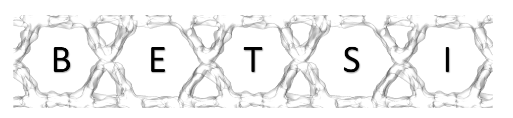
</p>  

<p align="center">
BET Surface Identification - a program that fully implements the Rouquerol criteria
</p>

<h3 align="center">
  
[](https://travis-ci.com/nakulrampal/betsi-gui)
[](https://aamplify.readthedocs.io/en/latest/?badge=latest) 
[](https://gitter.im/betsi-gui/community?utm_source=badge&utm_medium=badge&utm_campaign=pr-badge)  [](https://github.com/nakulrampal/betsi-gui/pulse)  [](https://github.com/nakulrampal/github-gui/LICENSE.txt)

</h3>

## Software Requirements:

### OS Requirements
This package is supported for *windows*, *macOS* and *Linux*. The package has been tested on the following systems:
+ Windows: 10 (10.0.19041)
+ macOS: Mojave (10.14.1)
+ Linux: Ubuntu 16.04

### Python Dependencies

`betsi-gui` mainly depends on the Python scientific stack.

```
numpy==1.19.3
scipy==1.5.4
matplotlib==3.2.2
PyQt5==5.9.2
pandas==1.1.5
seaborn==0.11.0
statsmodels==0.12.1
```
## Running BETSI from executable

Download the executables for *Windows* or *Linux* found in the repositories run them on your machine. This will automatically run the code for you and take you immediately to the [Instructions of use](#instructions-of-use) found below. If instead you wish to download the source code and install BETSI on your machine, please follow the steps below.

## Steps to install BETSI

*Estimated installation time*: ***10 minutes***

Download Anaconda from https://anaconda.org for your operating system. Once you have done so, open the Anaconda Navigator program.
# 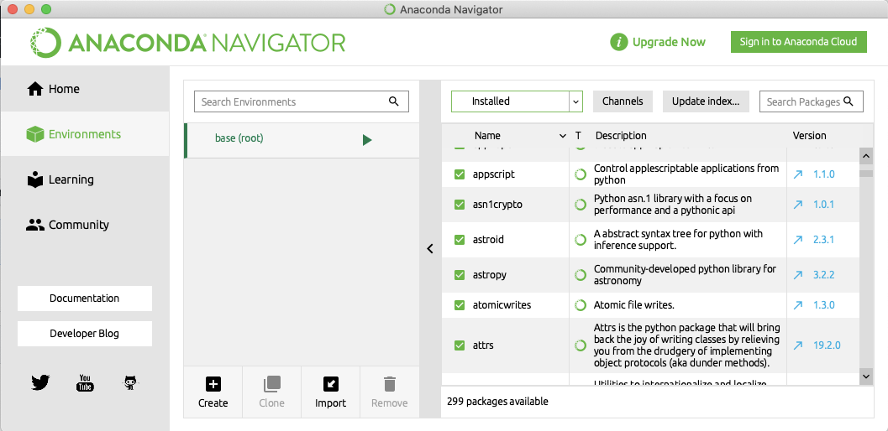
Next, create a new environment by clicking **Create** on the bottom left corner. You can give your environment and arbitrary name (we have called ours **betsi**) and select as a package **Python 3.7**.
# 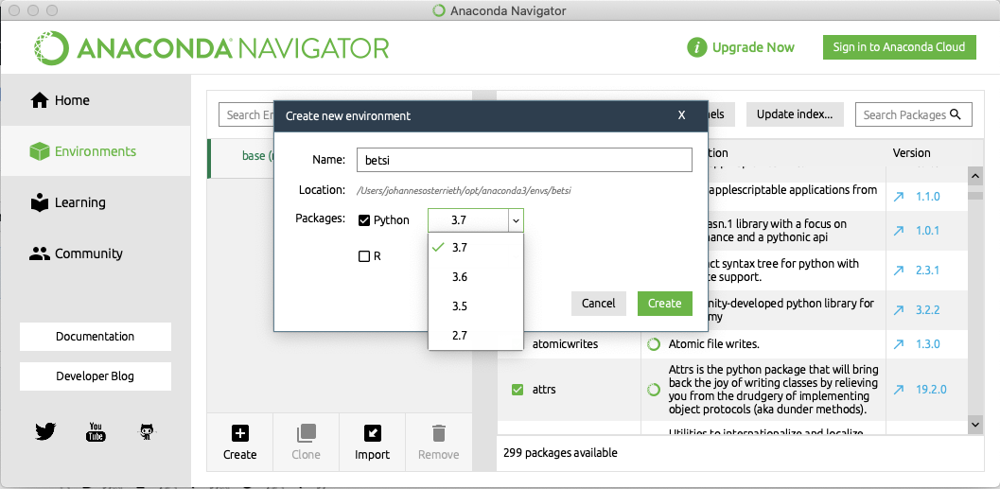
If you have successfully created a new environment, it should appear under the base environment. Next, click the :arrow_forward: button in the newly created environment and select **Open Terminal**
# 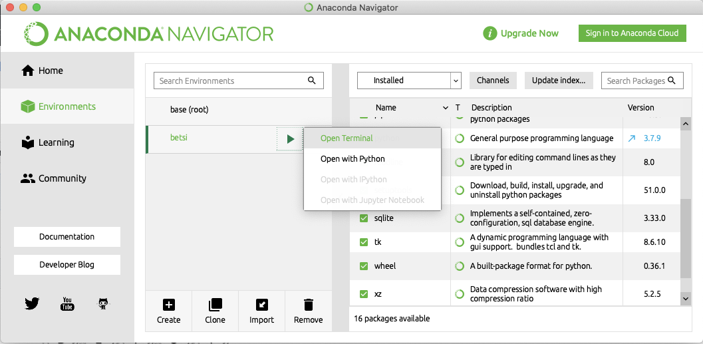
This will prompt a command terminal in the new environment.
# 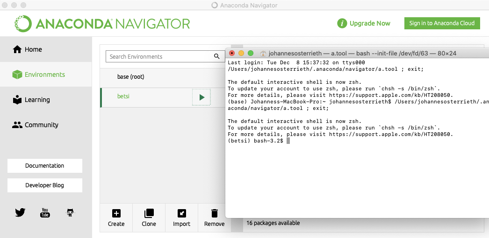
Next, type in the command: 
```
python -m pip install --extra-index-url https://testpypi.python.org/pypi betsi-gui
```
# 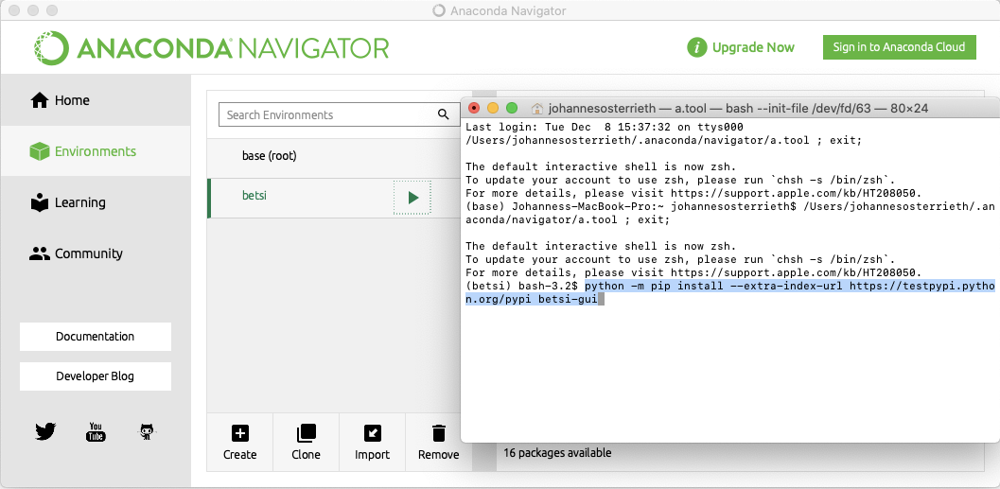
This will install BETSI in the newly created environment and download all the relevant python packages from our test server.

## Instructions of use

*Estimated run time*: ***5 minutes***

Next, to run BETSI, type in the command: ```python -m betsi```

# 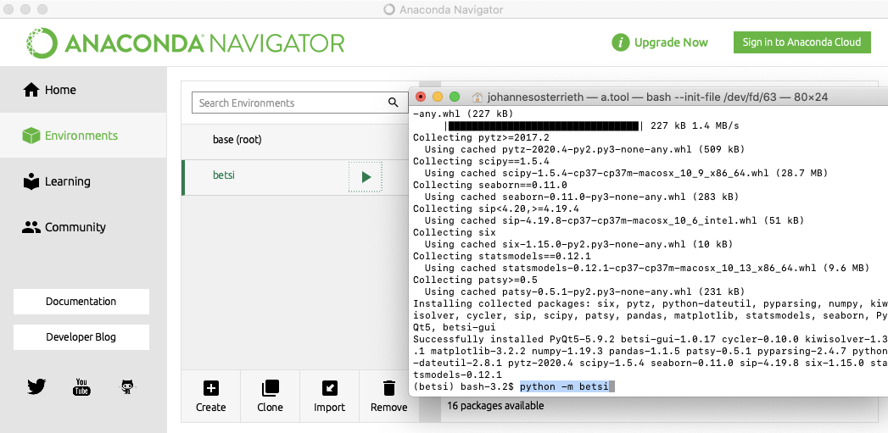
Run the command, which will prompt the BETSI GUI. This step may take some time. The BETSI GUI will appear with its default settings as laid out in the Rouquerol criteria. Run an isotherm in the GUI by dragging a correct .csv file into the empty space on the right. Test isotherms can be found in the repository. Note that isotherms will only run successfully in BETSI if they are in the same format as the exemplary isotherms, further information can be found in section [Test Dataset](#test-dataset) below.
# 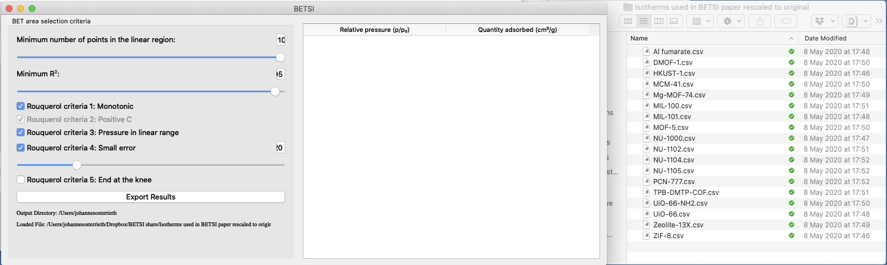
The code will run automatically and two windows appear. For a full explanation of all figures, please refer to the Supplementary Information of the manuscript, Section S5. 
# 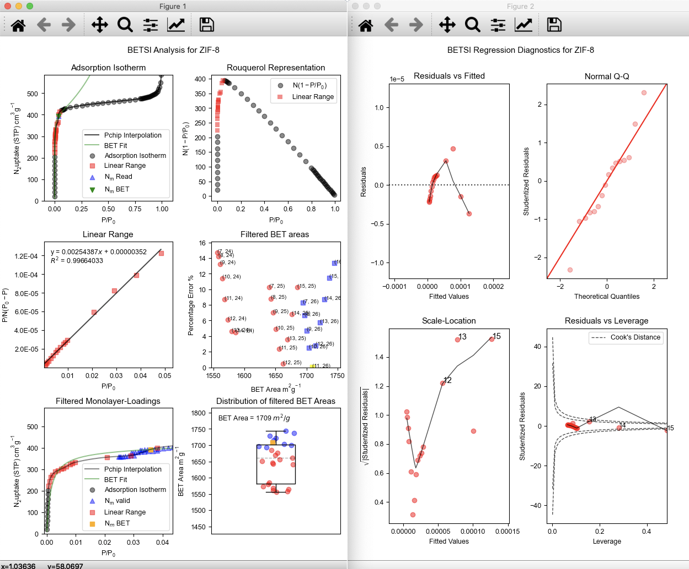
Further, you can interact with the GUI by manually selecting other Rouquerol-permitted BET areas. In the 'Filtered BET areas' plot, click on one of the other points. All plots will automatically update to the new selected linear region/BET area. The 'active' plot is always shown in yellow.
# 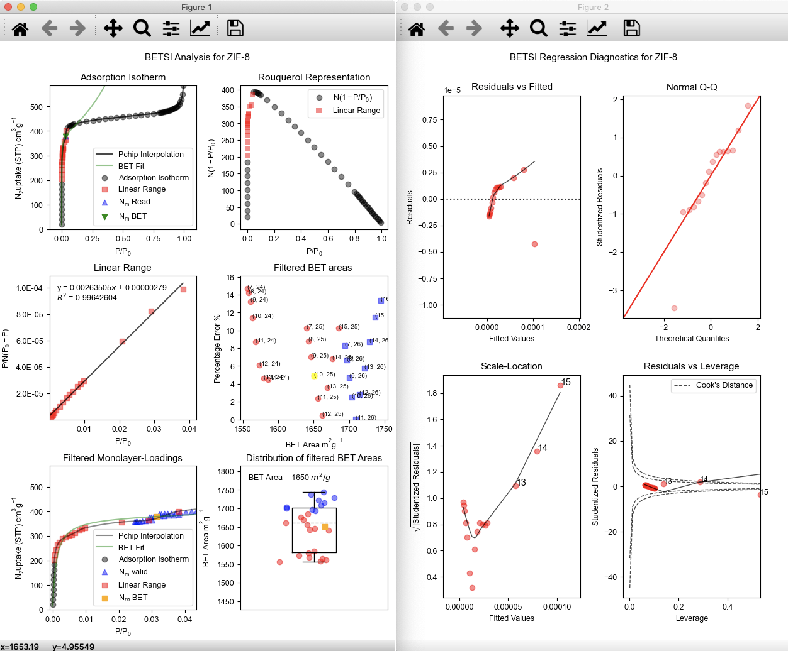
To output BETSI data, select an output directory and click 'Export Results' in the GUI.
# 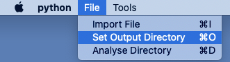
The specified directory will contain pdf prints of the two active plots (BETSI analysis and regression diagnostics), a .json file specifying the filter criteria, a .txt file featuring a small summary, and a folder containing all matrices that the program uses.
# 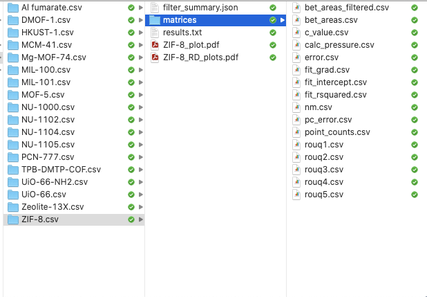
Analyse a new isotherm in BETSI by clearing the current plot either via Tools-> Clear, or by pressing the hotkey combination CMD/CNTRL+C.
# 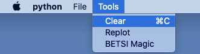


## Test Dataset

A test dataset of isotherms is supplied on this repository. To run the isotherms in BETSI, download the dataset and drag isotherms into the BETSI GUI as described above. If you would like to try BETSI with your own dataset, you will need to convert it first into the same format as the test isotherms: It must be a 2-column .csv file with the relative pressure in the first column and the adsorbed quantity in the second. The first row will not be read as this usually contains the header. You must use an adsorption isotherm only, a desorption swing, or discontinuity in the adsorption from pressure equilibration issues will result in an error, with the PChip interpolation method.

## License

BETSI is distributed under the MIT open source license (see [`LICENSE.txt`](LICENSE.txt)).

## Acknowledgements

Main Developers: James Rampersad and Johannes W. M. Osterrieth

Maintained by: Nakul Rampal

This work is supported by:
* [Cambridge International Scholarship](https://www.cambridgetrust.org/) funded by the Cambridge Commonwealth, European & International Trust;
* [Trinity-Henry Barlow Scholarship](https://www.trin.cam.ac.uk/) (Honorary) funded by Trinity College, Cambridge.

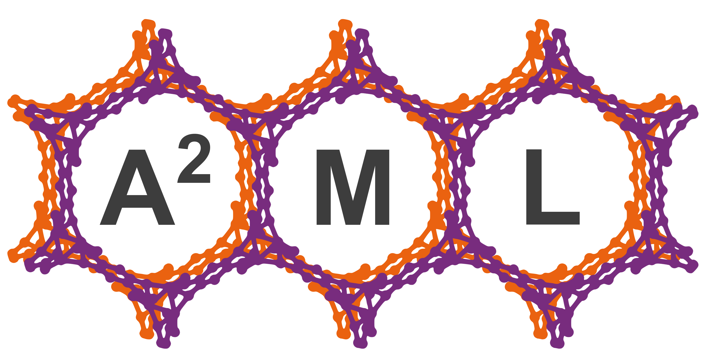


